# ter-homeworks-03

## Задание 1

<table>
  <tr>
    <td>Входящий трафик</td>
    <td>Исходящий трафик</td>
  </tr>
  <tr>
    <td>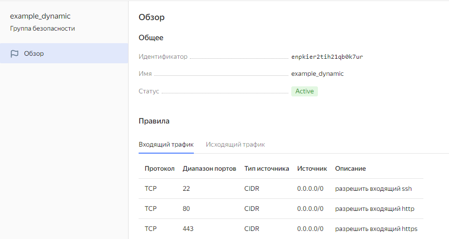</td>
    <td>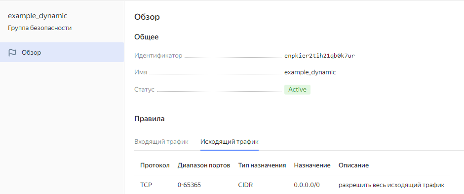</td>
  </tr>
  <tr>
    <td>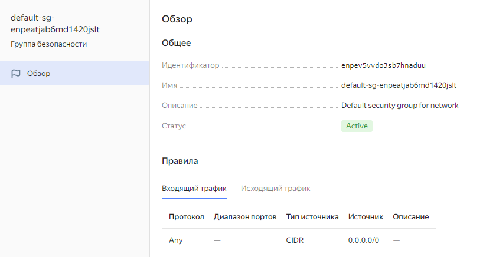</td>
    <td>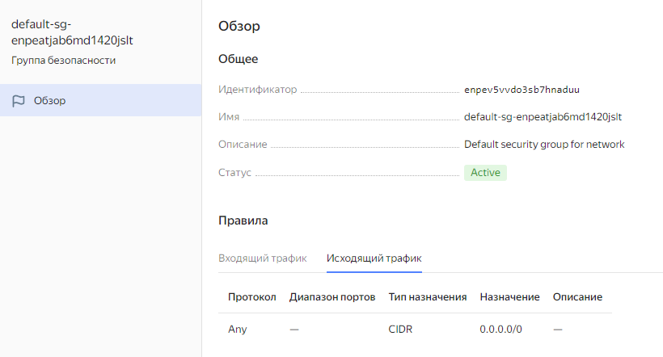</td>
  </tr>
 </table>

## Задание 2

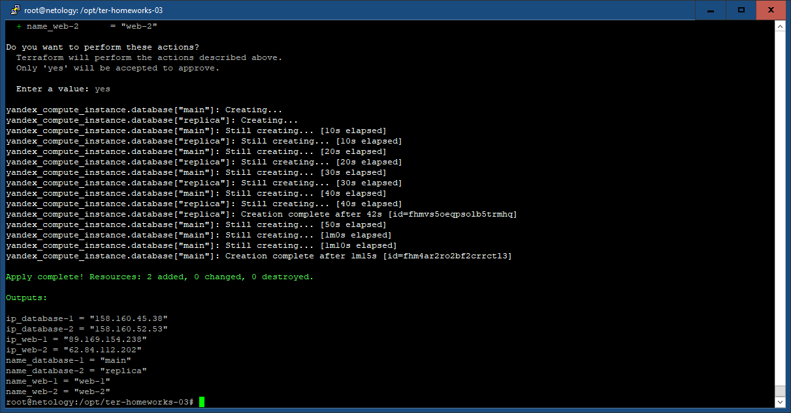

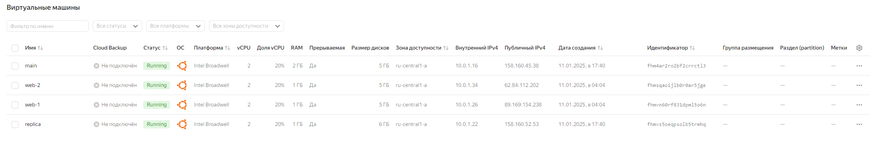

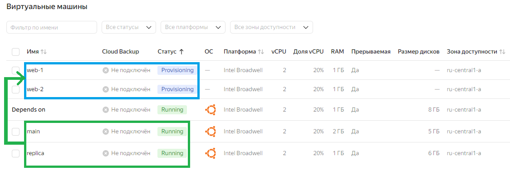

## Задание 3

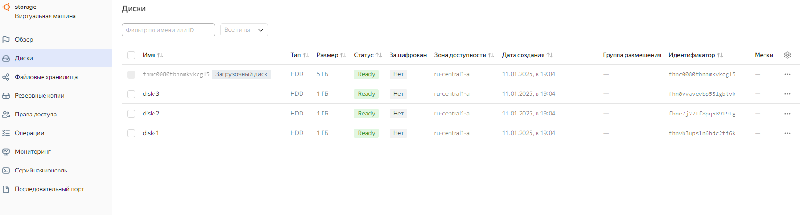


## Задание 4

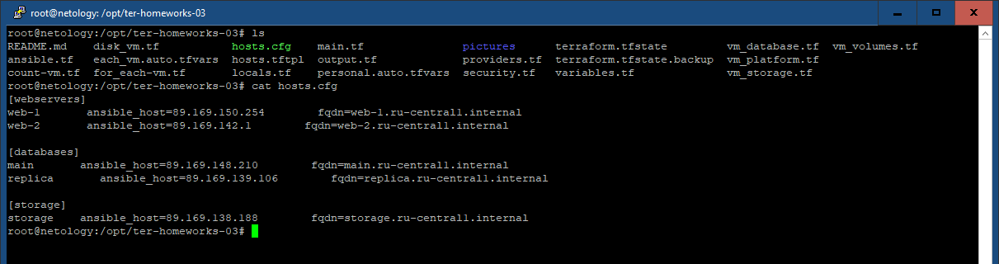

## Задание 5

output.tf:

```
output "all_inst" {
  value = flatten([
    [for inst_pl in yandex_compute_instance.platform : {
      name = inst_pl.name
      id = inst_pl.id
      fqdn = inst_pl.fqdn
    }],
    [for inst_db in yandex_compute_instance.database : {
      name = inst_db.name
      id = inst_db.id
      fqdn = inst_db.fqdn
    }],
    [{
      name = yandex_compute_instance.storage.name
      id = yandex_compute_instance.storage.id
      fqdn = yandex_compute_instance.storage.fqdn
    }]
  ])
}
```

terraform output:

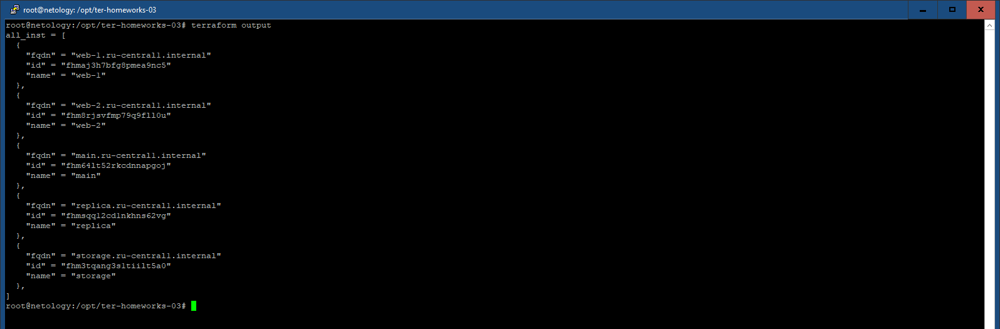

## Задание 6

6.1.:

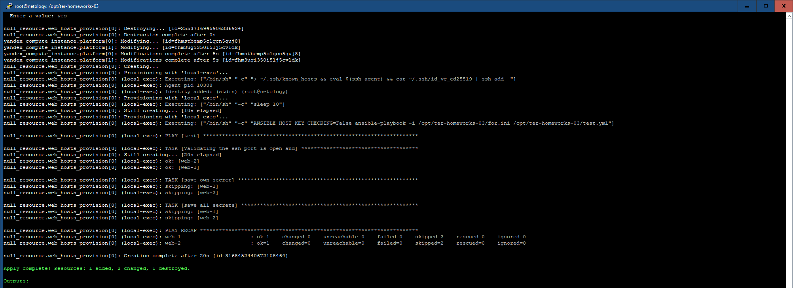

6.2.:

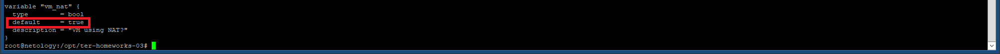

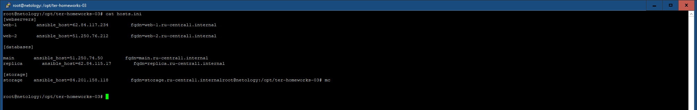

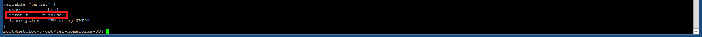

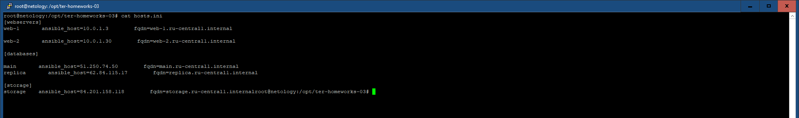

## Задание 7

В terraform console:

```
{ network_id = local.vpc.network_id, 
  subnet_ids = [for i in local.vpc.subnet_ids : i if i != local.vpc.subnet_ids[2]],
  subnet_zones = [for i in local.vpc.subnet_zones : i if i != local.vpc.subnet_zones[2]] 
}
```

Результат:

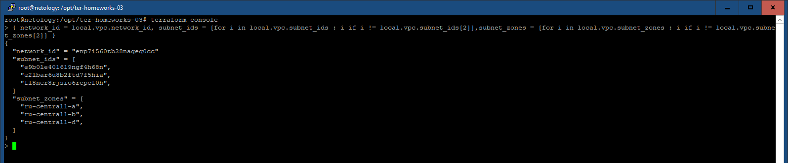

## Задание 8

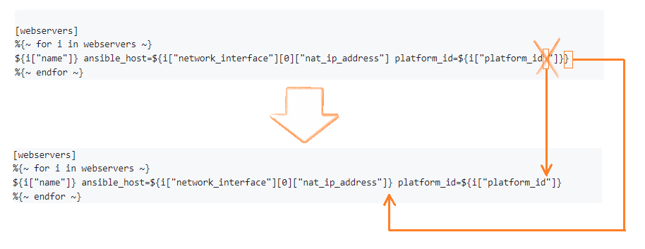

1. Фигурная скобка, закрывающая выражение ansible_host=${i["network_interface"][0]["nat_ip_address"] ошибочно смещена в конец строки
2. Опечатка в наименовании индекса ["platform_id "] для i. Лишний пробел.

## Задание 9

...
