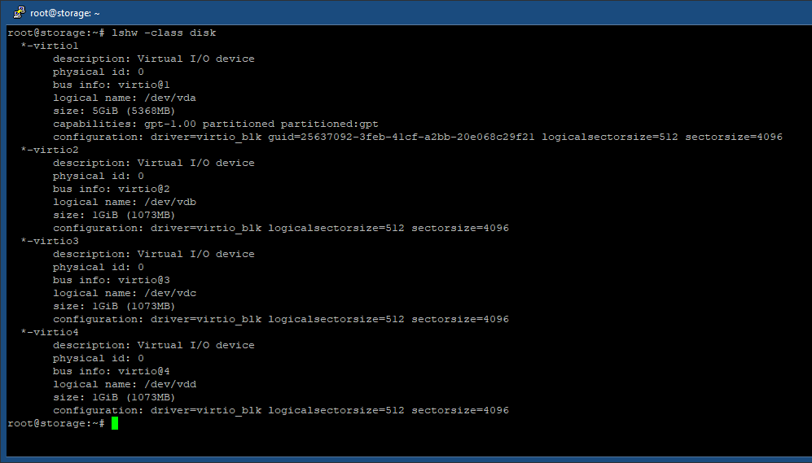

# ter-homeworks-03

## Задание 1

<table>
  <tr>
    <td>Входящий трафик</td>
    <td>Исходящий трафик</td>
  </tr>
  <tr>
    <td></td>
    <td></td>
  </tr>
  <tr>
    <td></td>
    <td></td>
  </tr>
 </table>

## Задание 2


## Задание 3




## Задание 4


## Задание 5

output.tf:

```
output "all_inst" {
  value = flatten([
    [for inst_pl in yandex_compute_instance.platform : {
      name = inst_pl.name
      id = inst_pl.id
      fqdn = inst_pl.fqdn
    }],
    [for inst_db in yandex_compute_instance.database : {
      name = inst_db.name
      id = inst_db.id
      fqdn = inst_db.fqdn
    }],
    [{
      name = yandex_compute_instance.storage.name
      id = yandex_compute_instance.storage.id
      fqdn = yandex_compute_instance.storage.fqdn
    }]
  ])
}
```

terraform output:


## Задание 6

6.1.:


6.2.:


